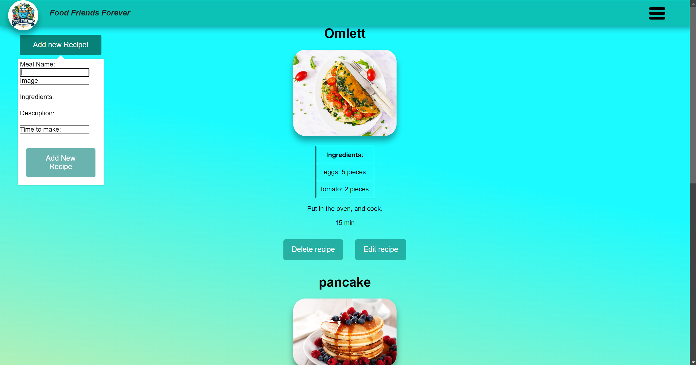
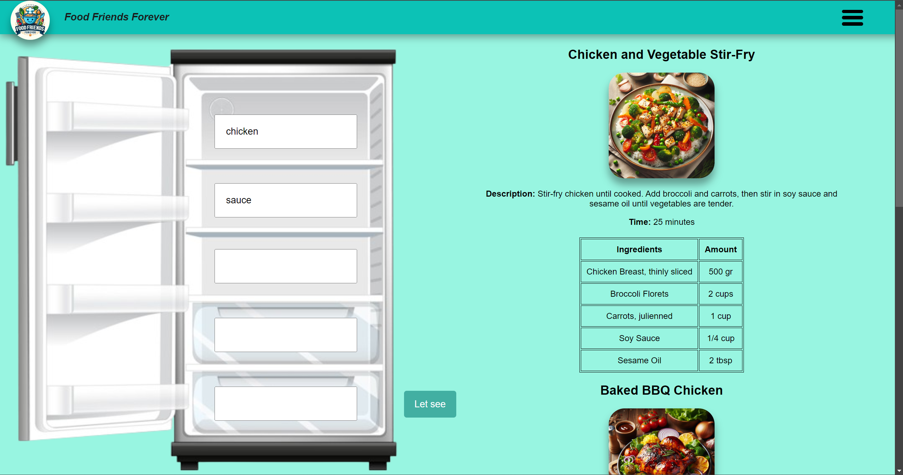

# MERN Stack Recipe Storage Application (Dockerized with Nginx)

The Recipe Storage Application is a full-stack web application built using the MERN stack (MongoDB, Express.js, React, and Node.js). The project has been fully containerized using Docker, and Nginx has been integrated to serve the frontend for optimized performance. This application allows users to register, upload recipes, search for recipes, save their favorite recipes, and use the "What is in my fridge" feature to find recipes based on available ingredients. Additional features include pagination and a rating system for recipes.

This project was developed as part of my **DevOps specialization**, where I focused on containerizing the application and ensuring its deployment readiness. The Docker setup provides a fully functional application with preloaded recipes, ready for use.

## Developed by:
- [Eszter Fodor](https://github.com/eszti9902)
- [Brigitta Zsugonics](https://github.com/zsbrigi)
- [Roland Keszeg](https://github.com/keszegroland)
- [Andor Margitics](https://github.com/mrgitics) (DevOps, containerization, Nginx setup)
- [Vazul Magyar](https://github.com/Vazul15)

## Features
- **User Registration:** Register and log in to manage recipes.
- **Recipe Management:** Create, update, and delete recipes.
- **Favorite Recipes:** Save recipes for later.
- **Pagination:** Browse recipes with moving pagination.
  - 
- **Profile Page:** Manage your own recipes.
  - 
- **Comments and Ratings:** Add and view comments and ratings on recipes.
  - 
- **"What is in my fridge":** Find recipes based on ingredients.
  - 

## Technologies Used
- **Backend:** Node.js, Express.js
- **Frontend:** React
- **Database:** MongoDB
- **Libraries:** Mongoose (for MongoDB), React Router (for routing)
- **Containerization:** Docker, Docker Compose
- **Web Server:** Nginx (for serving the React app)

## Containerization and Nginx Setup
This project is fully containerized using Docker. The Docker setup includes:

- **MongoDB container** for the database.
- **Node.js container** for the backend server.
- **React frontend container** served by Nginx.

The **Nginx** web server is used to serve the React frontend for better performance and scalability. The application is preloaded with basic recipes to showcase functionality immediately after setup.

## Dockerfile Breakdown

### Client (React + Nginx)
- The frontend is built using Node.js in an **Alpine** environment for a smaller image.
- After building the React app, Nginx serves the static files.

### Backend (Node.js + Express)
- The backend is also based on the **Alpine** version of Node.js, ensuring a lightweight environment.
- After installing dependencies, the backend exposes port **5001** and starts the application.

### MongoDB
- The **MongoDB** container runs the database for the application, with persistent storage configured through Docker volumes.

## Architecture
The application is structured into three main components, each containerized for isolation and scalability:
- **Frontend (React + Nginx):** Handles user interface and client-side logic.
- **Backend (Node.js + Express):** Manages API requests and business logic.
- **Database (MongoDB):** Stores user and recipe data.

## Setup and Installation

### Prerequisites
- Ensure that Docker and Docker Compose are installed on your system.

### Steps to Run the Application

1. **Clone the repository:**
   ```bash
   git clone https://github.com/mrgitics/dockerized-mern-recipe-app.git

2. **Navigate to the project directory**

    cd <directory>

3. **Build and start the Docker containers:**

    docker-compose up --build
    This command will build the Docker images for the client, server, and database, and start the containers.

4. **Access the application:**

    The frontend will be available at: http://localhost:3000 (served via Nginx)
    The backend API can be accessed at: http://localhost:5001

### Default Recipes
- The application comes preloaded with several recipes, allowing you to explore its features immediately without having to add your own recipes.

### Environment Variables
- The necessary environment variables are already configured in the `docker-compose.yml` file. No additional setup is required.

### Exposed Ports
- Frontend (Nginx): Port 3000
- Backend (Node.js): Port 5001
- Database (MongoDB): Port 27017

### Volumes
- mongo-data: Stores MongoDB data to ensure persistence across container restarts.

### Deployment
- This setup is ready for deployment. By utilizing Docker Compose, you can easily deploy the entire application stack on any machine with Docker installed. Nginx ensures the React    frontend is efficiently served, while the backend and MongoDB containers handle the business logic and data storage.


